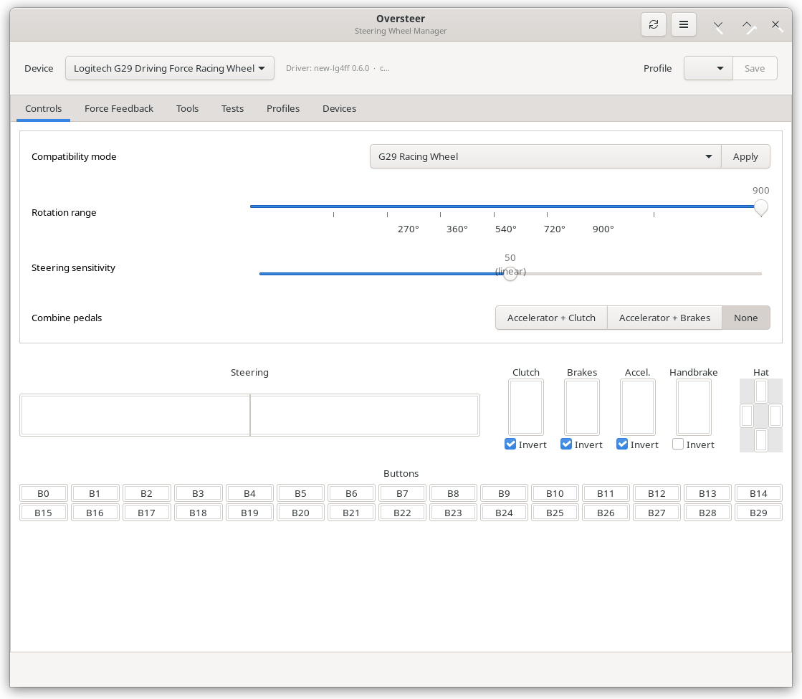
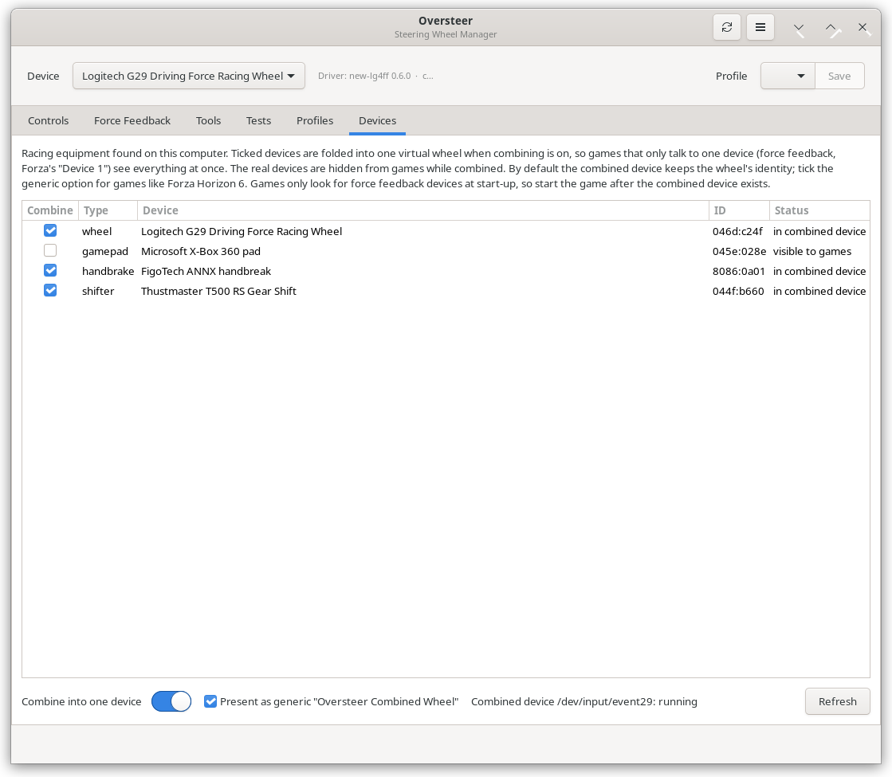

# Oversteer — Steering Wheel Manager for Linux

<p align="center">
  
</p>

A fork of [berarma/oversteer](https://github.com/berarma/oversteer) aimed at
making a Logitech G29 on Linux match — and then beat — what it does on
Windows. It pairs with the [new-lg4ff fork](https://github.com/marthofdoom/new-lg4ff),
which adds the driver side of the same work.

_Oversteer_ manages steering wheels using the features the loaded driver
provides. It doesn't provide hardware support: you still need a driver module
that supports your wheel, and most wheels won't have force feedback without
one.

__Use at your own risk. Suggestions, bugs and pull requests welcome.__

## What this fork adds

**Force feedback and wheel settings** (with the
[new-lg4ff fork](https://github.com/marthofdoom/new-lg4ff)):

- Steering sensitivity curve, like the Windows software.
- Force feedback on/off, keeping the strength settings for when it's back on.
- Persistent centering spring, and a switch for whether games may lower the
  strength themselves.
- Rumble strength, true inertia, and global gain up to 150 %.
- **Try** buttons that play each effect on the wheel so you can feel what it
  does, rotation range presets, and a reset to sane defaults.
- Pedals are **inverted at the driver by default** so games read them the way
  they expect (0 released, full pressed) instead of backwards. The Controls
  tab shows each axis as a game receives it, with an Invert box per pedal and
  one for the handbrake; a profile carries whatever you choose.

**One device for games that only listen to one** (Devices tab):

- Fold a wheel, shifter, handbrake, pedals and button box into a single
  virtual device, with force feedback passed through to the wheel, and hide
  the real ones from games. This exists because Forza Horizon 6 sends force
  feedback only to the first device it finds, so a connected shifter or
  handbrake silently kills it.
- The handbrake stays an axis, a T500 RS / TH8A sequential plate is carried as
  two buttons, and the combined device can present itself as the wheel (so
  games apply their built-in profile) or as a generic device.

<p align="center">
  
</p>

**Rev lights from game telemetry** (Tools tab):

- The wheel's LEDs fill with engine RPM and flash at the shift point, which is
  set as a percentage of the redline or as an RPM figure, per profile.
- Reads Forza Horizon / Motorsport "Data Out", BeamNG / Live for Speed
  OutGauge, and the Codemasters layout used by DiRT Rally 2.0, DiRT 4 and
  WRC Generations.
- Games with no UDP telemetry at all — Assetto Corsa, Competizione and Rally —
  are covered by `oversteer-run`, a Steam launch-options wrapper that runs a
  small helper inside the game's Proton prefix and forwards its shared-memory
  telemetry. The Tools tab shows the exact launch options with a Copy button.

**Hotkeys while you drive** (Hotkeys tab):

- Bind a wheel button or a keyboard key to the shift point, force feedback
  on/off and strength, centering spring, spring, damper, friction, rumble,
  rotation range, sensitivity, or the next/previous profile. The rev LEDs show
  the new level for a moment.
- Wheel buttons are saved with the profile. Keyboard keys go through the
  desktop's shortcut portal (assign them in System Settings → Shortcuts →
  Oversteer on Plasma), so they work over a full-screen game and Oversteer
  never reads the keyboard.

**Diagnostics**: `scripts/probe-device.py` names the raw events of any device,
including one hidden or grabbed by the proxy; `scripts/telemetry-capture.py`
shows what arrives on the telemetry port and how it decodes.

Pieces of this are being sent back upstream as separate pull requests.

## Install (this fork)

- **Flatpak** (any distro): download `Oversteer-<version>.flatpak` from the
  [releases](https://github.com/marthofdoom/oversteer/releases) and run
  `flatpak install Oversteer-<version>.flatpak`. The Devices tab's combined
  device needs, on the host, `python3-evdev`, `python3-pyudev` and polkit;
  the app installs the service itself (asks for the administrator password).
- **From source**: `meson setup build -Dprefix=/usr/local && sudo ninja -C build install`.
- Pair with the [new-lg4ff fork](https://github.com/marthofdoom/new-lg4ff)
  (`.deb` on its releases page) for the Logitech features above.

Everything below is from upstream and still applies.

## Supported devices

_Oversteer_ maintains a list of known wheel devices. If your wheel isn't
recognized, please contact me.

This section lists devices currently recognized. Being in this list doesn't
imply good hardware support. __When thinking about buying a wheel don't rely
solely on the information here__.

_Oversteer_ recognizes the following Logitech wheels which are supported by the
default in-kernel module:

- Wingman Formula GP
- Wingman Formula Force GP
- Driving Force / Formula EX
- Driving Force Pro
- Driving Force GT
- Momo Force
- Momo Racing Force
- Speed Force Wireless
- G25 Racing Wheel
- G27 Racing Wheel
- G29 Driving Force Racing Wheel (PS3 mode)
- G920 Driving Force Racing Wheel
- Logitech G923 for XBox (since Linux 6.3)
- OpenFFBoard, (https://github.com/Ultrawipf/OpenFFBoard).

Wheels using the Logitech driver (except XBOX/PC versions) can get improved
support using [new-lg4ff](https://github.com/berarma/new-lg4ff), with more
effects and features. Some games won't have full FFB without it.

The following wheels will need custom driver modules for FFB support.
These drivers are still being worked on. **(I'm NOT claiming they will fully
work. Please, check the related projects for more information.)**:

- Logitech G923 for PS/PC with [new-lg4ff](https://github.com/berarma/new-lg4ff).
- Thrustmaster T150 with [t150_driver](https://github.com/scarburato/t150_driver).
- Thrustmaster TMX Force Feedback with [t150_driver](https://github.com/scarburato/t150_driver).
- Thrustmaster T300 RS with [hid-tmff2](https://github.com/Kimplul/hid-tmff2).
- Thrustmaster T248 with [hid-tmff2](https://github.com/Kimplul/hid-tmff2).
- Thrustmaster TS-XW Racer with [hid-tmff2](https://github.com/Kimplul/hid-tmff2).
- FANATEC CSL Elite Wheel Base with [hid-fanatecff](https://github.com/gotzl/hid-fanatecff).
- FANATEC CSL Elite Wheel Base PS4 with [hid-fanatecff](https://github.com/gotzl/hid-fanatecff).
- FANATEC ClubSport Wheel Base V2 with [hid-fanatecff](https://github.com/gotzl/hid-fanatecff).
- FANATEC ClubSport Wheel Base V2.5 with [hid-fanatecff](https://github.com/gotzl/hid-fanatecff).
- FANATEC Podium Wheel Base DD1/DD2 with [hid-fanatecff](https://github.com/gotzl/hid-fanatecff).
- FANATEC CSL DD / GT DD Pro Wheel with [hid-fanatecff](https://github.com/gotzl/hid-fanatecff).

These wheels are recognized but don't have driver support (Force Feedback and
other features won't work):

- Thrustmaster Force Feedback Racing Wheel
- Thrustmaster TX Racing Wheel
- Thrustmaster T500 RS
- Thrustmaster T80
- Thrustmaster Ferrari 458


## Features

When supported by the device and the driver:

- Change rotation range.
- Change emulation/working modes.
- Combine accelerator/brakes pedals for games that use just one axis.
- Change autocentering force strength.
- Change force feedback gain.
- Device configuration profiles.
- Overlay window to display/configure range.
- Use wheel buttons to configure range.
- Hardware performance testing.
- Combine accelerator/clutch pedals. Useful for flight
  simulators. (Not supported with in-kernel modules)
- Change global force feedback gain. (Not supported with in-kernel modules)
- Change each conditional force feedback effect type gain. (Not supported with in-kernel modules)
- FFBmeter to monitor FFB clipping using wheel leds or overlay
  window. (Not supported with in-kernel modules)

## Installation

DISCLAIMER: When running commands starting with `sudo` you're requesting admin
rights to perform the operation. These commands will make changes to your
system that should only performed by a system administrator or someone knowing
what they're doing.

### AppImage

@Samueru-sama has kindly created an [AppImage](https://github.com/pkgforge-dev/Oversteer-AppImage/releases) that can run on any distribution without installing
anything.

### Arch

Darvin Delgado (@DNModder) has kindly created an [AUR
package](https://aur.archlinux.org/packages/oversteer/). Install following
the [Arch Wiki
instructions](https://wiki.archlinux.org/index.php/Arch_User_Repository#Installing_packages).

### Gentoo

@gripped has kindly created a [Gentoo ebuild](https://github.com/gripped/Logitech-wheel-ebuilds).

### Flathub

Joshua John (@jo5huajohn) has kindly made a [Flatpak
package](https://flathub.org/apps/io.github.berarma.Oversteer) available at
Flathub.

#### Permissions

After installing the Flatpak package, permission files have to be installed manually.

Copy the contents of
[https://github.com/berarma/oversteer/tree/master/data/udev](https://github.com/berarma/oversteer/tree/master/data/udev)
into `/usr/lib/udev/rules.d`.

If you're using the terminal, these commands will install the permission files:

```
sudo wget https://github.com/berarma/oversteer/raw/refs/heads/master/data/udev/99-fanatec-wheel-perms.rules -P /usr/lib/udev/rules.d/
sudo wget https://github.com/berarma/oversteer/raw/refs/heads/master/data/udev/99-logitech-wheel-perms.rules -P /usr/lib/udev/rules.d/
sudo wget https://github.com/berarma/oversteer/raw/refs/heads/master/data/udev/99-thrustmaster-wheel-perms.rules -P /usr/lib/udev/rules.d/
```

Restart your computer, or reload udev rules with command:

`sudo udevadm control --reload-rules && sudo udevadm trigger`.

### Other distributions

#### Requirements

Install all dependencies on Debian systems with the following command:

`sudo apt install git python3 python3-distutils python3-gi python3-gi-cairo
python3-pyudev python3-xdg python3-evdev gettext meson appstream-util
desktop-file-utils python3-matplotlib python3-scipy`

Install all dependencies on Fedora systems with the following command:

`sudo dnf install git python3 python3-distutils-extra python3-gobject
python3-pyudev python3-pyxdg python3-evdev gettext meson appstream
desktop-file-utils python3-matplotlib-gtk3 python3-scipy libappstream-glib`

Install all dependencies on OpenSUSE systems with the following command:

`sudo zypper in git python3 python3-distutils-extra python3-gobject
python3-pyudev python3-pyxdg python3-evdev meson AppStream desktop-file-utils
python3-matplotlib-gtk3 python3-scipy gettext-tools`

For other distributions, use your package manager to find and install the
equivalent packages.

#### Permissions

Accessing the wheel settings requires some permissions.

**_Oversteer_ will automatically install udev rules to grant these permissions
to any user in the system after a reboot.**

By default, the udev rules will be installed at
`/usr/local/lib/udev/rules.d` when installing to prefix `/usr/local` or
`/lib/udev/rules.d` when installing to any other prefix. The location can
be changed using meson option `udev_rules_dir` but it shouldn't be
required except maybe for packagers.

Older rules might be already installed at `/etc/udev/rules.d` or
`/lib/udev/rules.d`. You may need to remove these files manually in case
you're experiencing issues with permissions.

The installed udev rules files will have these names:

- `99-fanatec-wheel-perms.rules`
- `99-logitech-wheel-perms.rules`
- `99-thrustmaster-wheel-perms.rules`

#### Build and install

Start by downloading `Oversteer` and change your working directory to it. It
could be a release package or the master branch.

```
git clone https://github.com/berarma/oversteer.git
cd oversteer
```

Prepare build system:

```shell
meson setup build
cd build
```

Installing (needs administration rights):

`ninja install`

A reboot will be needed to reload the newly installed udev rules.
Alternatively, running the command `udevadm control --reload-rules && udevadm
trigger` will do the same.

#### Uninstalling

Run these commands inside the project directory to uninstall:

```shell
cd build
ninja uninstall
```

#### Updating

To avoid leaving old files behind, it's recommended to always uninstall the old
version first, then install the new version.

Follow the uninstall instructions for the old version, then follow the install
instructions for the new version.

## Using it

_Oversteer_ can be launched as any desktop application. It doesn't need to
be running for the settings to remain changed, but some features require
it.

It can also be used from the console to change wheel settings. Run
`oversteer --help` to see the command line help.

Leillo1975 has kindly created a [video explaining the basics of Oversteer
(Spanish)](https://www.youtube.com/watch?v=WdIV1FOkFsw).

### Using it as a companion app to your games

You can configure game launchers to run _Oversteer_ and load a profile or change
settings so that it automatically configures the wheel when the game runs. When
the game exits the app will close too. Please, refer to the command line help
for more info.

It can also stop before the game runs so you can change some settings manually
each time. This can be done from the command line or from a setting in the UI.

An example that would work for any Steam game would be:

`oversteer -p myprofile -g "%command%"`

### Telemetry from games with no UDP output (this fork)

Assetto Corsa, Assetto Corsa Competizione and Assetto Corsa Rally publish
telemetry only through Windows shared memory, which under Proton stays inside
the game's prefix. Put this in the game's Steam launch options and the rev
lights work anyway:

`oversteer-run %command%`

It runs the game untouched and starts a small helper next to it, inside the
same prefix, that forwards the engine RPM to Oversteer over UDP. The Tools tab
shows the exact string for your installation with a Copy button. Games that
send UDP telemetry themselves (Forza, BeamNG, DiRT, WRC) need nothing but the
port set in the same place.

## Known issues

- Most drivers don't support Global Gain and Autocenter settings, only
  `new-lg4ff` for now. The Linux API is used instead when they aren't
  available. If this happens, Oversteer has to reset their values everytime it
  starts. Also, games will be able to override these settings.

## Updating translations (for translators)

From the project root directory:

```shell
ninja oversteer-pot
ninja oversteer-update-po
```

## Contributing

We could all greatly benefit from your help as with any other free software
project.

Reports about what works and what not on different devices and systems are very
welcome. You can also help by contributing specific notes for your distro, or
doing the packaging work and everything else.

## Disclaimer

THE SOFTWARE IS PROVIDED "AS IS", WITHOUT WARRANTY OF ANY KIND, EXPRESS OR
IMPLIED, INCLUDING BUT NOT LIMITED TO THE WARRANTIES OF MERCHANTABILITY,
FITNESS FOR A PARTICULAR PURPOSE AND NONINFRINGEMENT. IN NO EVENT SHALL THE
AUTHORS OR COPYRIGHT HOLDERS BE LIABLE FOR ANY CLAIM, DAMAGES OR OTHER
LIABILITY, WHETHER IN AN ACTION OF CONTRACT, TORT OR OTHERWISE, ARISING FROM,
OUT OF OR IN CONNECTION WITH THE SOFTWARE OR THE USE OR OTHER DEALINGS IN THE
SOFTWARE.
