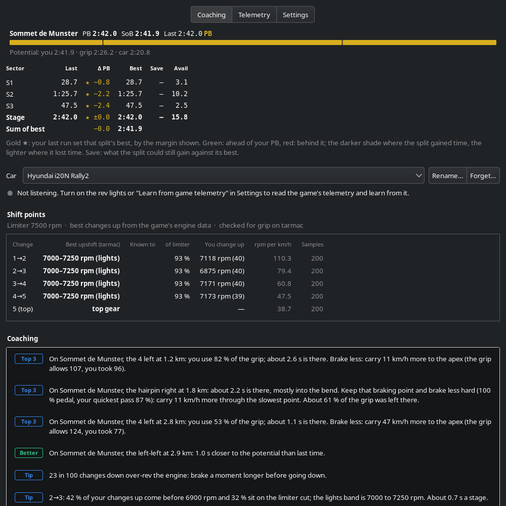
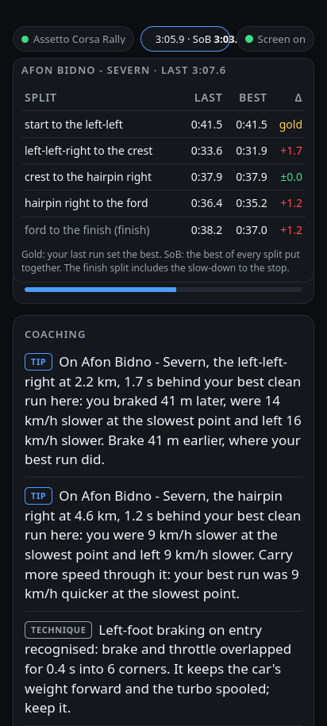
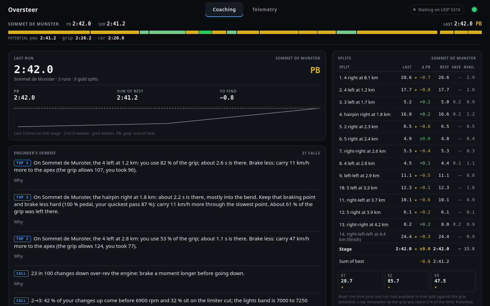
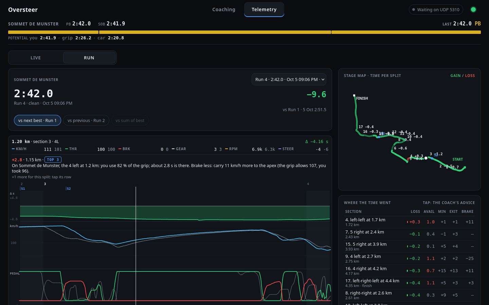
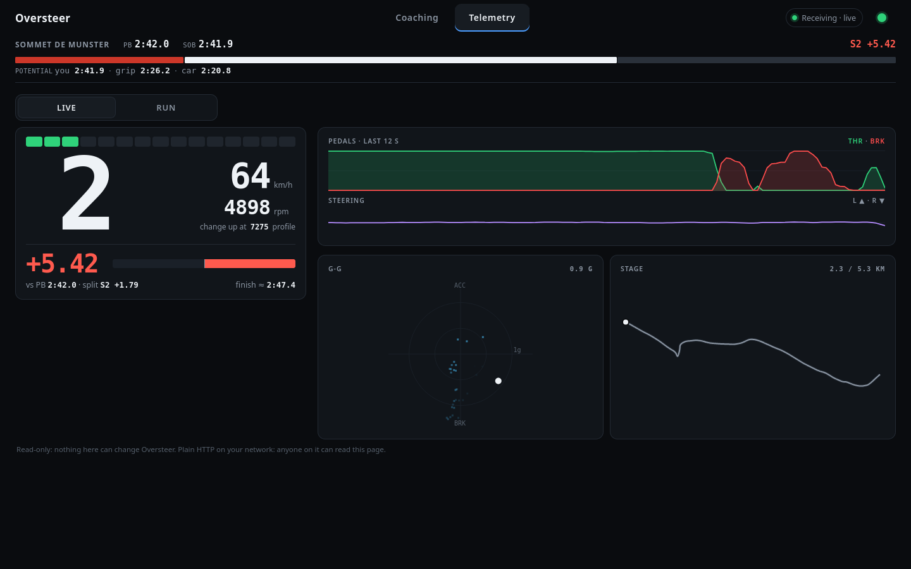
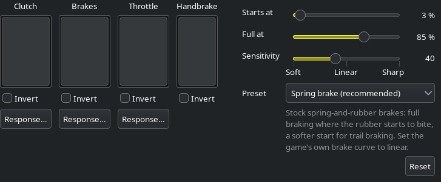
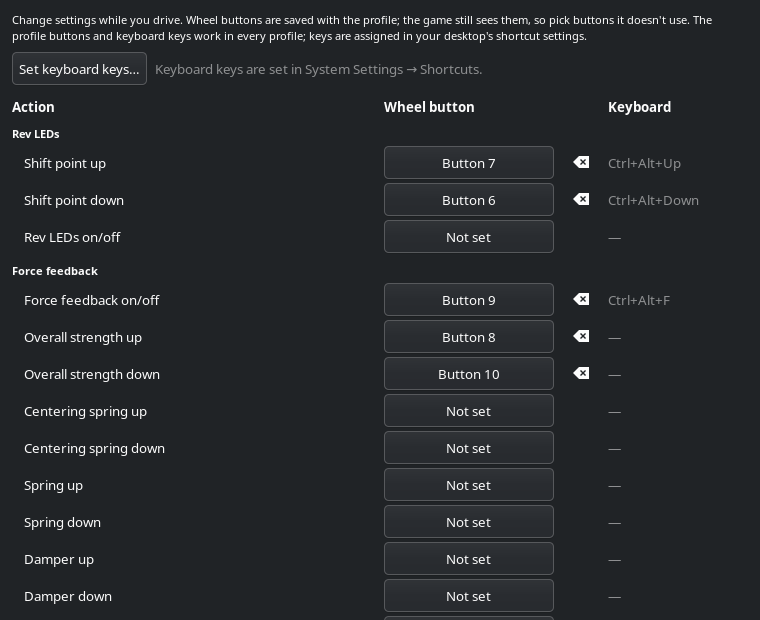
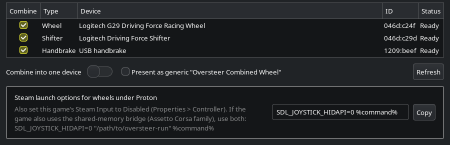

# Countersteer

**A steering-wheel manager and rally coach for Linux, built for Assetto Corsa Rally.**
Shift lights learnt from the game's own car data, a launch limiter, coaching that names the
corner where you lost time, speedrun-style splits, and a stage page for your phone.

**[Live demo](https://marthofdoom.github.io/oversteer/)**: the trackside page running on the author's real
Assetto Corsa Rally runs (live, run analysis and coaching), in your browser, nothing to install.

<p align="center">
  
</p>
<p align="center"><sub>The Telemetry tab (Assetto Corsa Rally, Hyundai i20N Rally2, Sommet de Munster). Real output from the author's own
runs, not a mock-up. The three tips say what the corner needs (brake later, brake less, carry speed) from the grip left there.</sub></p>

> **Status.** Countersteer is the new name of this fork of Oversteer. The code, the app ID, the
> binaries (`oversteer`, `oversteer-run`), the Flatpak and the paths still use the old name for now;
> the instructions below say `oversteer` where that is what you type. Personal project: built
> for one rig (Logitech G29), tested mostly with Assetto Corsa Rally. **Use at your own risk.**

## For Assetto Corsa Rally players

What you get, all from the game's telemetry (no overlay, nothing injected into the game):

- **Rev lights at the right RPM.** For each of the game's 18 cars, the engine and gearing come from
  the game's own files (torque curve, limiter, gear sets, final drive, tyre radius). The best
  upshift is worked out per gear and per surface (a gear that spins its wheels on gravel is
  lowered to where the next gear pulls as hard), and the wheel's LEDs follow it. Where the data
  disagrees with what you drive, Countersteer says so and learns instead.
- **Launch limiter.** At a standing start (clutch in, handbrake up, throttle floored) it learns the
  RPM the car holds, so the shift light is a percentage of the real limiter at each launch.
- **Coaching.** Every stage is kept as a run, with its corners and gear changes. The coach picks
  the habit to work on first (up to three tips with numbers) and, where it can, says where:
  the corner, how much time it cost, and what your best clean run did there. It also praises
  what improved and tries not to call a technique a fault (left-foot braking, for one, is
  recognised). It is a rule-based coach working from your own history: read the
  [coaching design](docs/telemetry-coaching.md) and the
  [technique catalogue](docs/coach-techniques.md) to see what it does and does not know.
- **Splits and sum of best.** Each stage is cut into sections; the Telemetry tab and the web page
  show last, best and difference per split (gold when your last run set the best) and the sum of
  best, LiveSplit-style. The three sectors are the game's own sector lines, not an even cut of
  the stage, and the coach diagnoses each corner (late braking, braking too hard, too little
  speed through it) against the grip the car has there.
- **Stage recognition.** The stage is recognised from the game's stage table, and times are taken
  at the flying finish line rather than at the stop, so the result time stops before the
  slow-down.
- **A trackside page on the LAN** (off by default, read-only): the live gear, revs and progress
  along the stage, coaching, splits and the shift tables on a phone or tablet next to the rig,
  with a keep-awake so the screen stays on. Plain HTTP: anyone on your network can read it, and
  it can be limited to this computer.

<p align="center">
  
  &nbsp;&nbsp;
  
</p>
<p align="center"><sub>The phone/laptop page on the author's own runs: the game's three sectors (S1 to S3) with the potential lap, and the coaching.</sub></p>

The Telemetry > Run view lines the run up against your best: speed, pedals, steering, gear and
revs as strips over the stage, a stage map drawn from the game's positions, and where the time went
with the coach's advice for each split. The Live view shows the delta to your best as you drive.

<p align="center">
  
  &nbsp;
  
</p>
<p align="center"><sub>Run view (left, the PB against the next best run) and Live view (right, a slower run against the PB), both from the
author's own captures; the live image is a capture replayed through the live path.</sub></p>

### Quick setup

Assetto Corsa Rally has no UDP telemetry; it publishes through Windows shared memory, which
under Proton stays inside the game's prefix. `oversteer-run` runs a small bridge inside that
prefix and forwards it to Countersteer over UDP (port 5310 by default).

1. In Steam, open the game's **Properties → Launch Options** and set (the Telemetry tab's
   Settings and the Devices tab show the exact line for your install, with a Copy button):

   ```
   SDL_JOYSTICK_HIDAPI=0 /path/to/oversteer-run %command%
   ```

   Environment variables go **before** `oversteer-run`; `oversteer-run` runs the game as-is, so
   anything after it is part of the game's command line. `SDL_JOYSTICK_HIDAPI=0` stops SDL in
   Proton from driving a Logitech wheel itself, which bypasses the kernel driver and your
   settings.
2. Set the game's **Steam Input** to *Disabled* (Properties → Controller).
3. Start Countersteer, open **Telemetry → Settings**, turn on the rev lights or "Learn from game
   telemetry" (and the web page if you want it), then start the game.

Logs: `<steam library>/steamapps/compatdata/<appid>/oversteer-run.log` (launcher and Proton output)
and `oversteer-shm-bridge.log` next to it (what the bridge found and sent).

## For Logitech owners: the new-lg4ff driver fork

Logitech wheels need a driver that exposes more than the kernel's `hid-logitech`. Countersteer
pairs with **[marthofdoom/new-lg4ff](https://github.com/marthofdoom/new-lg4ff)**, a fork of
berarma's new-lg4ff that adds, for the pedals, **response curves per pedal**: a start deadzone, an
end deadzone and a sensitivity, plus the attributes Countersteer drives (overall strength, spring,
damper, friction and rumble levels, inertia, persistent centring spring, pedal inversion, combined
pedals, rotation range, wheel sensitivity). Install it from its releases page (a `.deb`) or build it.

Without it you still get telemetry and coaching; the response curves and most of the force-feedback settings need the fork (with an older
driver the **Response…** button stays greyed out).

Permissions: Countersteer ships udev rules that make the driver's attributes writable. When it
finds it can't change the wheel's settings, it offers to install them (asks for the administrator
password); you can also copy `data/udev/*.rules` to your rules directory yourself and reload udev.

## More of what this fork adds

**Pedal response curves** (Controls tab → *Response…* under each pedal). Where the pedal starts
(0 to 45 %), where it reaches full (55 to 100 %) and a curve, applied live in the driver and kept in
the profile. Presets: Linear, and **Spring brake** (3 % / 85 % / 40) for stock spring-and-rubber
brakes. Needs new-lg4ff.

<p align="center">
  
</p>

**Hotkeys while you drive** (Hotkeys tab). Bind a wheel button, or a keyboard key through the
desktop's GlobalShortcuts portal (so it works over a full-screen game and Countersteer never reads
the keyboard), to the shift point, force feedback on/off and strength, spring, damper, friction,
rumble, rotation range, sensitivity or the next/previous profile. Holding the button repeats the
step. The rev LEDs show the new level for a moment.

<p align="center">
  
</p>

**One device for games that only listen to one** (Devices tab). Fold a wheel, shifter, handbrake,
pedals and button box into one virtual device with force feedback passed through, and hide the real
ones. *Assetto Corsa Rally safety:* re-creating the virtual wheel while the game runs crashes it, so
Countersteer asks before applying the combined device, changing the handbrake direction or starting
the proxy service while a Wine/Proton game is running. The same tab has a **Steam launch options
helper** for wheels under Proton.

<p align="center">
  
</p>

**Other wheel settings**: steering sensitivity curve, force feedback on/off keeping the strength
settings, rotation range presets, **Try** buttons that play each effect on the wheel, and profiles.
Pedals are inverted at the driver by default so games read them the right way round.

### Other games (secondary)

The telemetry side also reads Forza Horizon / Motorsport "Data Out", BeamNG and Live for Speed
(OutGauge), the Codemasters layout (DiRT Rally 2.0, DiRT 4, WRC Generations) and EA SPORTS WRC.
Rev lights and shift learning work for all of them; coaching, stage tables and splits are built
and checked on Assetto Corsa Rally first and WRC Generations second, and the rest are less
exercised. Assetto Corsa and Assetto Corsa Competizione use the same `oversteer-run` bridge.
*Experimental:* anything not named above, and the web page's remote use beyond a trusted LAN.

`scripts/probe-device.py`, `scripts/telemetry-capture.py` and `scripts/telemetry-replay.py` help
diagnose a device or a telemetry stream; "Record raw telemetry" (off by default) keeps what the game
sends so a bug report can include it.

## Install and run

- **From source, to try it:** `scripts/run-dev.sh` (sets up a meson build directory on first run,
  then runs the app from this tree; needs the dependencies listed in
  [the upstream README](docs/upstream-readme.md#requirements)).
- **Install from source:** `meson setup build -Dprefix=/usr/local && sudo ninja -C build install`.
- **Flatpak:** a `Oversteer-<version>.flatpak` is built from `flatpak/` (see
  `scripts/build-flatpak.sh`); install it with `flatpak install Oversteer-<version>.flatpak`. The
  combined device needs `python3-evdev`, `python3-pyudev` and polkit on the host.
- The upstream README, kept for the supported-wheels list and per-distribution notes, is in
  [docs/upstream-readme.md](docs/upstream-readme.md). The change history is in
  [CHANGELOG.md](CHANGELOG.md).

## Credits and licence

Countersteer is a fork of **[Oversteer](https://github.com/berarma/oversteer) by Bernat Arlandis
(berarma)**, and its wheel support rests on his
[new-lg4ff](https://github.com/berarma/new-lg4ff). Thanks also to everyone credited in the upstream
README. Pieces of this are being sent back upstream where they fit.

Licensed under the **GNU General Public License v3.0** (see [LICENSE](LICENSE)); modified files
carry their history in git (`git log -p -- <file>`).
